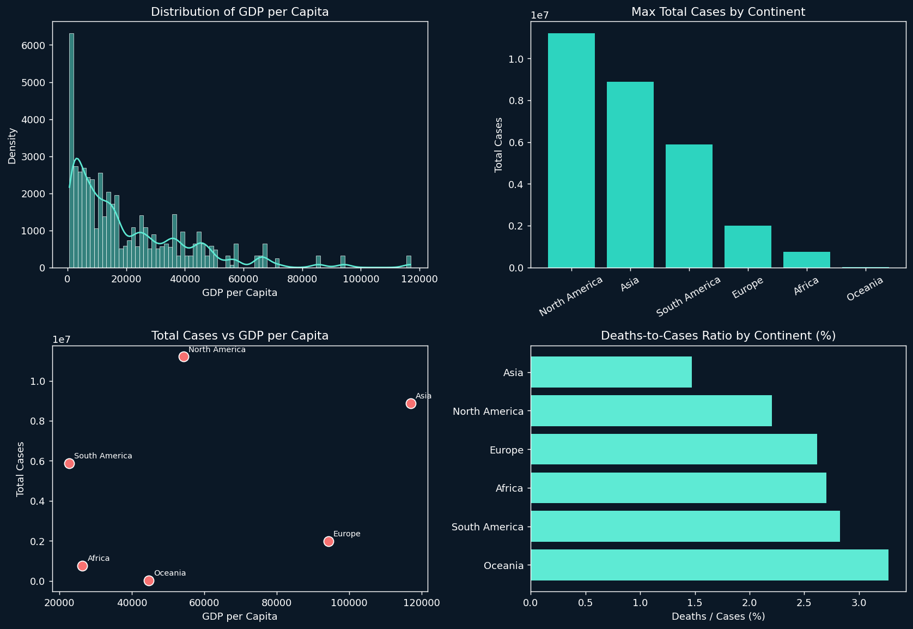

# 🦠 COVID-19 Data Analysis | Exploratory Data Analysis with Python

An end-to-end exploratory data analysis (EDA) project on global COVID-19 data — covering data cleaning, aggregation, feature engineering, and visualization using Python's data science stack.

---

## 📌 Overview

This project analyzes a global COVID-19 dataset to uncover patterns in case counts, deaths, and their relationship with economic and development indicators like GDP per capita and the Human Development Index (HDI). The workflow follows a complete, real-world data analysis pipeline — from raw data ingestion to visual storytelling.

---

---

## 📷 Preview

*GDP per capita distribution, continent-wise case totals, cases-vs-GDP relationship, and deaths-to-cases ratio — generated directly from the analysis in this notebook.*

---

## 🔍 What This Project Covers

**1. Data Exploration**
- Loaded and inspected the dataset (shape, data types, summary statistics)
- Identified unique locations and continent-wise frequency distribution

**2. Data Cleaning**
- Detected and removed duplicate records
- Identified and handled missing values (including dropping rows with missing `continent`, filling remaining nulls)
- Converted the `date` column to proper datetime format and extracted `month` as a new feature

**3. Data Aggregation & Feature Engineering**
- Grouped data by continent to find maximum values across key metrics
- Engineered a new feature: **deaths-to-cases ratio** to measure relative severity across continents

**4. Data Visualization**
- Univariate analysis of GDP per capita using histogram/distribution plots
- Scatter plot analyzing the relationship between total cases and GDP per capita
- Pairplot for multi-variable relationship analysis
- Bar chart comparing total cases across continents

---

## 🛠️ Tech Stack

| Category | Tools |
|---|---|
| Language | Python |
| Data Handling | Pandas, NumPy |
| Visualization | Matplotlib, Seaborn |
| Environment | Jupyter Notebook |

---

## 📊 Key Questions Answered

- Which continent has the highest number of COVID-19 cases?
- Which continent ranks highest in Human Development Index?
- Which continent has the lowest GDP per capita?
- Is there a visible relationship between a country's economic strength and COVID-19 case counts?
- What is the deaths-to-cases ratio across continents?

---

## 📁 Files

- `DATA_ANALYTIC.ipynb` — Full Jupyter Notebook with code, outputs, and visualizations
- `Covid_Old_Data.csv` — Cleaned dataset exported after processing

---

## 🚀 What This Project Demonstrates

- Structuring a complete EDA workflow from raw data to insights
- Practical data cleaning techniques (nulls, duplicates, type conversion)
- Feature engineering to derive meaningful new metrics
- Using visualization to communicate patterns across categorical and numerical data

---

## 👤 Author

**Saklim Alam**
📧 saklimalam085@gmail.com
🔗 [LinkedIn](https://www.linkedin.com/in/saklim-alam-483143209)
